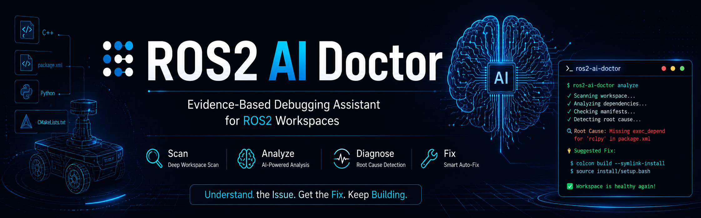
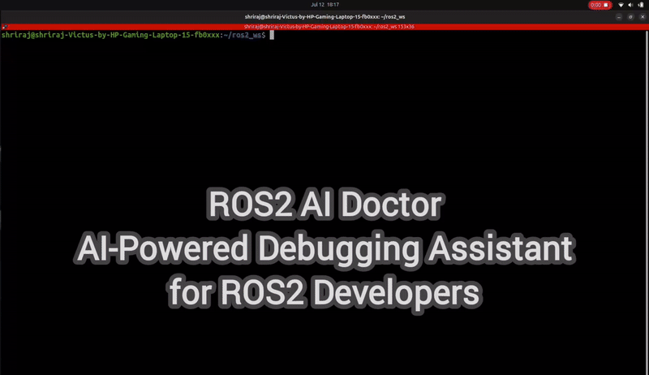
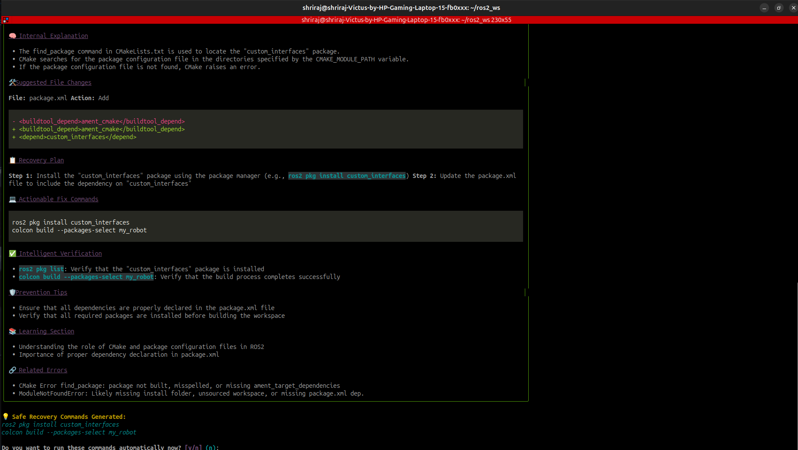
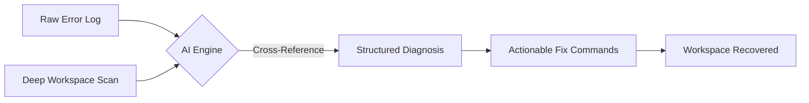
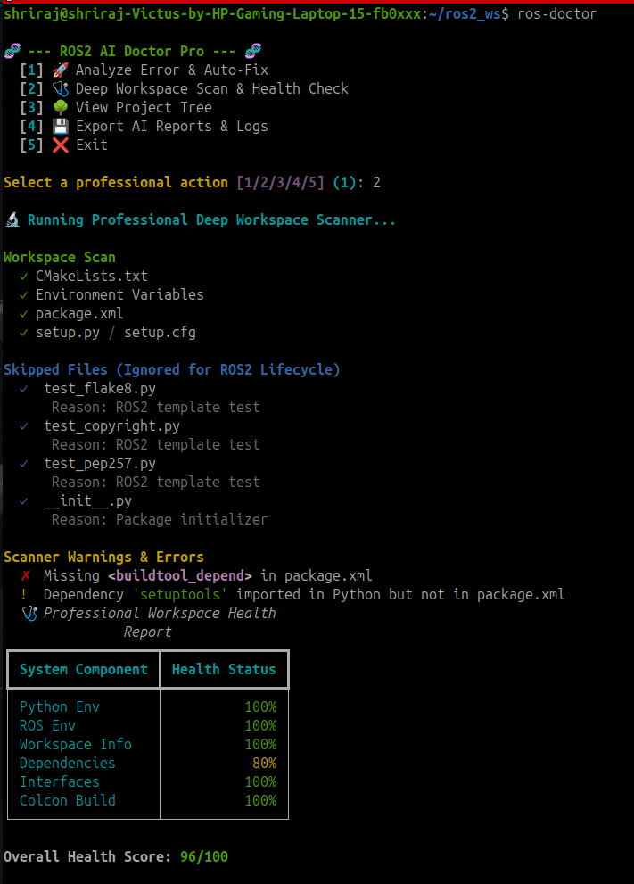

<div align="center">

<!-- 🖼️ PLACEHOLDER: GitHub Banner -->
<!-- Recommended size: 1280x400px -->


# 🩺 ROS2 AI Doctor

### Your AI-powered debugging companion for ROS2 workspaces

Stop guessing why `colcon build` failed. Get evidence-based, verified fixes — instantly.

<!-- 🏷️ BADGES (placeholders — swap in real shields.io links) -->


<!-- 🎬 PLACEHOLDER: Demo GIF -->


[Installation](#-installation) • [Usage](#-usage) • [Features](#-features) • [How It Works](#️-how-it-works) • [Roadmap](#️-roadmap)

</div>

---

## 📖 Overview

Debugging ROS2 is often more frustrating than it should be. A single runtime `ModuleNotFoundError` or a compile-time failure can come from:

- A missing `<exec_depend>` in `package.xml`
- A typo in `CMakeLists.txt`
- An unregistered `console_script` in `setup.py`

**ROS2 AI Doctor** exists to solve exactly this problem. It works **alongside** your existing tools — `ros2 doctor`, `colcon build`, and the rest of the ROS2 ecosystem — not as a replacement for them.

It intercepts raw errors, scans your workspace structure, and returns **verified, actionable recovery commands** grounded in real facts about your project — not speculative AI guessing.

<!-- 🖼️ PLACEHOLDER: Screenshot -->
<p align="center">
  
</p>

---

## 🤔 Why ROS2 AI Doctor?

| | `ros2 doctor` | Manual Debugging | **ROS2 AI Doctor** |
|---|:---:|:---:|:---:|
| Scans workspace structure | ✅ | ❌ | ✅ |
| Cross-validates XML / CMake / Python | ❌ | Manual & slow | ✅ Automated |
| AI-generated root cause analysis | ❌ | ❌ | ✅ Evidence-based |
| Confidence-ranked diagnosis | ❌ | ❌ | ✅ Confirmed / Likely / Possible |
| Automated recovery commands | ❌ | ❌ | ✅ Sequential, safe bash |
| Learns from past sessions | ❌ | ❌ | ✅ SQLite/JSON/Markdown memory |
| Replaces existing ROS2 tools | — | — | ❌ Complements them |

---

## ✨ Features

| Feature | Description |
|---|---|
| 🔍 **Deep Workspace Scanner** | Recursively parses `package.xml`, `CMakeLists.txt`, `setup.py`, and source nodes to validate your architecture. |
| 🔗 **Cross-Validation Matrix** | Detects mismatched dependencies between CMake lists, XML manifests, and actual Python/C++ imports. |
| 📊 **Dynamic Health Scoring** | Computes a real-time health index across Python Env, ROS Env, Dependencies, Interfaces, and Colcon Build. |
| 🤖 **Evidence-Based AI** | Powered by Llama-3.3-70B (via Groq); distinguishes between **Confirmed**, **Likely**, and **Possible** root causes based on scan evidence. |
| 🛠️ **Automated Recovery** | Generates safe, sequential bash commands you can run directly from the terminal. |
| 🧠 **AI Learning Memory** | Stores historical diagnostic sessions (SQLite, JSON, Markdown) to inform future troubleshooting. |

---

## 🧪 Supported Errors

| Category | Examples Detected |
|---|---|
| **Dependency Issues** | Missing `<exec_depend>` / `<build_depend>` in `package.xml`, mismatched CMake `find_package` calls |
| **Build Configuration** | Typos or missing entries in `CMakeLists.txt` (`ament_package`, `install`) |
| **Python Packaging** | Unregistered `console_script` entry points in `setup.py` / `setup.cfg` |
| **Import Errors** | `ModuleNotFoundError` and mismatches between declared and actual imports |
| **Node Lifecycle Issues** | Missing or malformed `rclpy.init()` / `shutdown()` bindings |
| **Manifest Errors** | Missing `<buildtool_depend>` tags in `package.xml` |

---

## ⚙️ How It Works

ROS2 AI Doctor follows a strict logical pipeline designed to prevent hallucinations and keep every fix grounded in real evidence:



---

## 🚀 Installation

### ⚡ Quick Start

```bash
git clone https://github.com/shrirajchavan002-pixel/ROS2-AI-Doctor.git
cd ROS2-AI-Doctor
python3 -m venv venv && source venv/bin/activate
pip install groq python-dotenv rich
echo "GROQ_API_KEY=gsk_your_api_key_here" > .env
python3 main.py
```

### Prerequisites

```bash
sudo apt update && sudo apt install -y python3-pip python3-venv tree
```

### Quick Setup

**1. Clone the repository**
```bash
git clone https://github.com/shrirajchavan002-pixel/ROS2-AI-Doctor.git
cd ~/ros2_error_explainer
```

**2. Create and activate a virtual environment**
```bash
python3 -m venv venv
source venv/bin/activate
```

**3. Install dependencies**
```bash
pip install --upgrade pip
pip install groq python-dotenv rich
```

**4. Add your API key**

Create a `.env` file in the root project directory with your Groq API key:
```bash
echo "GROQ_API_KEY=gsk_your_api_key_here" > .env
```

**5. (Optional) Create a global alias**

For easy access from any terminal:
```bash
echo "alias ros-doctor='~/ros2_error_explainer/venv/bin/python3 ~/ros2_error_explainer/main.py'" >> ~/.bashrc
source ~/.bashrc
```

---

## 💡 Usage

Launch the interactive console:

```bash
ros-doctor
```

```
🧬 --- ROS2 AI Doctor --- 🧬
  [1] 🚀 Analyze Error & Auto-Fix
  [2] 🩺 Deep Workspace Scan & Health Check
  [3] 🌳 View Project Tree
  [4] 💾 Export AI Reports & Logs
  [5] ❌ Exit
```

### 🚀 Option 1 — Analyze Error & Auto-Fix

1. The system starts an asynchronous background trace of your workspace.
2. Paste your terminal error logs (e.g., from `colcon build`).
3. Type `DONE` on a new line and press Enter.
4. Review the structured breakdown — if a definitive fix is found, type `y` to execute the recovery commands automatically.

### 🩺 Option 2 — Health Checks & Deep Scan

Runs a rigorous inspection of your local workspace, mapping your operational scope and flagging configuration divergence **before** errors even happen.

<!-- 🖼️ PLACEHOLDER: Screenshot -->
<p align="center">
  
</p>

---

## 🧠 Under the Hood (Architecture Details)

### Smart File Parsing

The scanner crawls `src/` to validate layouts, actively filtering out false positives such as tests (`test_*.py`), CI boilerplate (`test_copyright.py`), and `__init__.py` files.

- **`package.xml`** — Extracts and models manifest tags; flags missing `<buildtool_depend>`.
- **`CMakeLists.txt`** — Scans operational primitives (`find_package`, `ament_package`, `install`).
- **Python Packaging** — Parses `setup.py` & `setup.cfg` to verify entry points and runtime schemas.
- **Source Nodes** — Inspects `.cpp` / `.hpp` and `.py` targets for ROS2 lifecycle bindings (`rclpy.init()`, `shutdown()`).

### Non-Speculative AI Prompts

By feeding the LLM a structured, JSON-like snapshot of the workspace, responses include:

- **Confidence Breakdown** — separates fact-matched constraints from speculative anomalies.
- **File-Level Trace Mapping** — pinpoints exact lines in source configurations.
- **Unified Recovery Chain** — bundles deterministic bash arrays for safe execution.

---

## 📁 Project Structure

```
ROS2-AI-Doctor/
├── main.py             # Rich Terminal UI & Subprocess Orchestration
├── ai_engine.py        # Groq Llama 3.3 Client & Output Schema Enforcer
├── diagnostics.py      # Recursive File Parsers & Cross-Validator
├── history.py          # SQLite3 Database Controller & JSON/MD Exporters
└── logs/                # Persistent Storage for Diagnostic Sessions
```

---

## 💭 Why I Built This Project

Debugging ROS2 workspaces as a student and robotics builder often meant losing hours to small, hidden misconfigurations spread across `package.xml`, `CMakeLists.txt`, and `setup.py`. Existing tools are great at *reporting* errors but don't connect the dots between them.

ROS2 AI Doctor was built to close that gap — a companion tool that reads the whole workspace the way a experienced teammate would, and turns scattered error logs into a clear, evidence-backed fix.

---

## 🗺️ Roadmap

### v1.0 — Current
- [x] Deep Workspace Scanner
- [x] Cross-Validation Matrix
- [x] Dynamic Health Scoring
- [x] Evidence-Based AI Diagnosis (Groq / Llama 3.3)
- [x] Automated Recovery Commands
- [x] AI Learning Memory (SQLite / JSON / Markdown)

### v1.1 — Near-Term
- [ ] **Native Build Tool Hooks** — automatic forwarding of terminal build output streams upon build failure

### v2.0 — Long-Term
- [ ] **Colcon Extension** — intercept internal dependency graph builds (`colcon_core`) to debug system linkages in real-time
- [ ] **Local LLM Execution** — offline diagnostics via Ollama (e.g., `deepseek-r1`, `llama3.1`) for privacy-sensitive environments
- [ ] **Gazebo/SDF Simulation Parser** — extend the static analyzer to audit simulation boundaries, plugins, and environment models

---

<div align="center">

Built to sit alongside `ros2 doctor` and `colcon` — not replace them.

⭐ If this project helped you debug faster, consider starring the repo!

</div>
